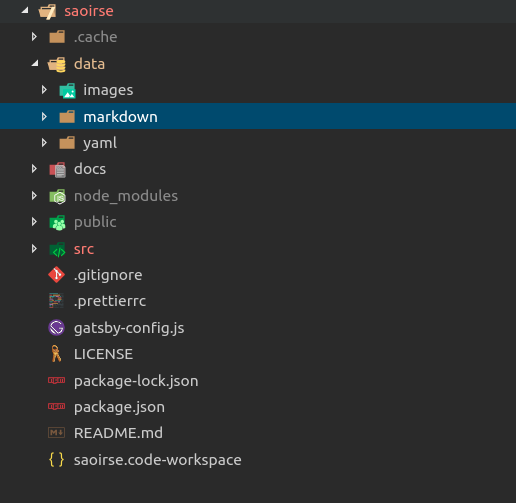

Since Saoirse is build on top of Gatsby, firing up a course is quite simple.

Download the template from [GitHub](https://github.com/ch-bu/saoirse). Next, make sure you have [node.js](https://nodejs.org/en/) installed. 

Install the packages:

```
npm install
```

You are then ready to start producing your content. Saoirse works with markdown files. Every markdown file has a specific frontmatter. For each markdown files you need the following information:

* `moduleTitle`: The title of the whole module. Right now you are in the about module.
* `module`: The index of the particular module. Always start with 0.
* `unitTitle`: Have a look at the menu on top of this page. That's the unit title (here: Saoirse). It should be the same for each markdown file within that unit.
* `unit`: The index of the particular unit. Always start with 0.
* `title`: Have a look at the submenu on the left. That's the title of the actual markdown document.
* `subunit`: The index of the markdown files within a unit. Again, start with 0.
* `type`: Have a look at the icons on the left on the submenu. These are the types. We have: `instruction`, `information`, and `question`. 

```
---
moduleTitle: About
module: 0
unitTitle: Saoirse
unit: 0
title: How does it work?
subunit: 1
type: question
---
```

All files have to be in the markdown folder. It makes sense to organize the markdown folders in subfolders, but that's not necessary. You can also name the files as you wish, but a good naming convention will make it easier for you to navigate the content.



After you have written all markdown files, fire up the application:

```
gatsby develop
```

Saoirse then builds the e-learning course from these files. You should be able to have a look at your e-learning course on `localhost:8000`.