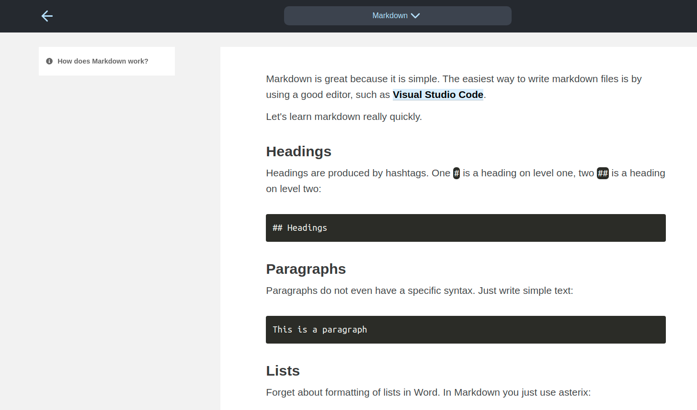

Let's learn markdown really quickly.

## Headings

Headings are produced by hashtags. One `#` is a heading on level one, two `##` is a heading on level two:

```
## Headings
```

## Paragraphs

Paragraphs do not even have a specific syntax. Just write simple text:

```
This is a paragraph
```

## Lists

Forget about formatting of lists in Word. In Markdown you just use asterix:

* Item 1
* Item 2
* Item 3

```
* Item 1
* Item 2
* Item 3
```

## Links

To write [links](https://github.com/ch-bu/saoirse), use the following syntax.

```
[Saoirse](https://github.com/ch-bu/saoirse)
```

## Bold text

**Simple**: `**Simple**`.

## Italic text

*Even simpler*: `*Even simpler*`.

## Adding images

Very often you need images. First, put the image in the same folder where your markdown document is. Then use the following syntax to add the image:

```

```

