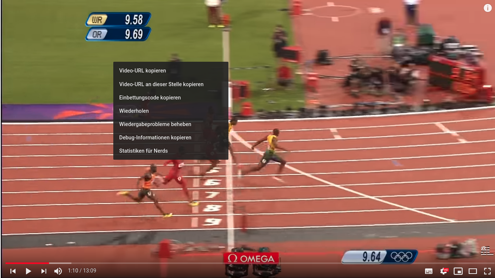

Videos are crucial for e-learning. Hence I tried to make it as easy as possible to add videos to Saoirse.

## YouTube

Copy the iframe from a youtube video:



Add the iframe to your markdown file:

```
<iframe width="1225" height="689" src="https://www.youtube.com/embed/kE7D7qFayVg?list=PLYuNGulOxMmWpRTz857AKx4Oh4r68Q48s" frameborder="0" allow="accelerometer; autoplay; encrypted-media; gyroscope; picture-in-picture" allowfullscreen></iframe>
```

<iframe width="1225" height="689" src="https://www.youtube.com/embed/EWPFmdAWRZ0?list=PLYuNGulOxMmWpRTz857AKx4Oh4r68Q48s" frameborder="0" allow="accelerometer; autoplay; encrypted-media; gyroscope; picture-in-picture" allowfullscreen></iframe>


### mp4

To add mp4 Videos you can use a custom component. Add your video to the /static/videos/ folder. Then add the following snippet to your markdown file:

```
<video name="/videos/example_video.mp4"></video>
```

<video name="/videos/example_video.mp4"></video>


### I want to make the video bigger without the white background

No problem. Just change the type in the markdown header to video:

```markdown
---
moduleTitle: About
unitTitle: Components
title: How to insert videos?
module: 0
unit: 2
subunit: 0
type: video
---
```